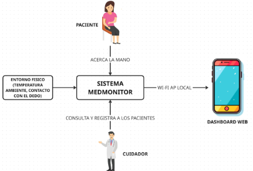
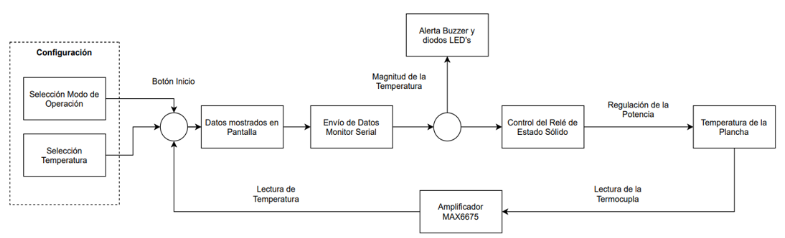
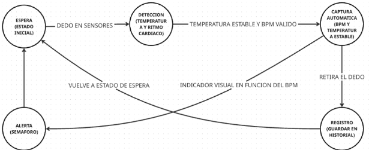

# MedMonitor: Sistema de Telemetría Médica IoT 🩺
*Proyecto desarrollado para la materia de Sistemas Embebidos - ESPOL.*  
**Autor:** Yandri Fernando Haro Morales

Monitor biométrico portátil basado en ESP32 para la medición no invasiva de temperatura corporal y frecuencia cardíaca en tiempo real con transmisión a interfaz web.

---

## 📌 Características Principales
* **Adquisición No Invasiva:** Sensores MAX30102 (BPM) y MLX90614 (Temperatura corporal por infrarrojos).
* **Edge Computing:** Servidor web local alojado en el propio ESP32 (modo Access Point Wi-Fi local).
* **Alertas Clínicas y Accesibilidad:** Clasificación visual por semáforo LED (Verde/Amarillo/Rojo), pantalla OLED con texto amplio y dashboard web adaptado.
* **Autonomía Redundante:** Operación mediante batería LiPo 3.7V con módulo TP4056 y elevador Boost Step-Up a 5V/3.3V, o alimentación directa por USB.

---

## 📂 Estructura del Repositorio
* `/Firmware`: Código fuente en C++ (PlatformIO / Visual Studio Code).
* `/Hardware`: Diagramas de conexión (Fritzing) y diseño de circuito impreso PCB (Proteus ARES/ISIS).
* `/Mechanics`: Modelos 3D de la carcasa para impresión (Archivos STL).
* `/assets`: Diagramas del documento de diseño (arquitectura, estados y contexto).

---

## 🛠️ Tecnologías y Herramientas
* **Microcontrolador:** ESP32 DevKit V1
* **Entorno de Desarrollo:** Visual Studio Code + PlatformIO
* **Diseño Electrónico:** Proteus ARES/ISIS & Fritzing
* **Sensores:** MLX90614 (I2C) & MAX30102 (I2C)

---

# 📄 DOCUMENTACIÓN DE DISEÑO (MEDMONITOR)

## 1. INTRODUCCIÓN Y CONTEXTO DEL SISTEMA
MedMonitor es un sistema embebido de telemetría médica portátil basado en ESP32 para medición no invasiva de temperatura corporal (MLX90614) y frecuencia cardíaca (MAX30102). Integra pantalla OLED, semáforo LED visual y transmisión inalámbrica vía Access Point Wi-Fi local a un dashboard web interactivo.

*Figura 1: Interacción entre Paciente, Sistema MedMonitor (Entorno Físico), Cuidador y Dashboard Web.*

---

## 2. ALCANCE Y LIMITACIONES
- **Adquisición Automática:** Captura por proximidad vía I2C (sin botones).
- **Clasificación de Estado:** Modos Normal / Advertencia / Alerta con semáforo LED e historial de 10 registros en RAM.
- **Limitaciones:** No mide SpO2 ni presión arterial; dispositivo no certificado para diagnóstico médico formal. Datos no persistentes.

---

## 3. DIAGRAMA DE BLOQUES Y ARQUITECTURA FÍSICA
El sistema cuenta con una arquitectura de alimentación redundante y procesamiento centralizado:
- **Alimentación:** Batería LiPo 3.7V con cargador TP4056 y módulo Boost Step-Up a 5V/3.3V, o USB directo.
- **Procesamiento y Sensores:** ESP32 conectado vía I2C a sensores MAX30102 y MLX90614.
- **Envío de Datos:** Transmisión desde el módulo Wi-Fi (SoftAP) usando protocolo HTTP/JSON hacia la interfaz web.

*Figura 2: Interconexión física entre fuente de alimentación, microcontrolador ESP32, sensores I2C, pantalla OLED, LEDs y servidor Web.*

---

## 4. MÁQUINA DE ESTADOS Y CONDICIONES DE TRANSICIÓN
Ciclo de control secuencial con reglas de transición explicitadas a continuación:

*Figura 3: Transiciones entre estados: ESPERA → DETECCIÓN → CAPTURA AUTOMÁTICA → REGISTRO / ALERTA.*

| Estado Origen | Estado Destino | Condición de Transición / Criterio Físico |
| :--- | :--- | :--- |
| **ESPERA** | **DETECCIÓN** | Lectura infrarroja IR ≥ 20,000 counts en el sensor MAX30102. |
| **DETECCIÓN** | **CAPTURA AUTOMÁTICA** | Estabilidad de 3 s con varianza < 0.2 °C y BPM válido. |
| **CAPTURA AUTOMÁTICA** | **ALERTA / ADVERTENCIA** | **Umbrales:** • *Normal:* 60 ≤ BPM ≤ 100 y 36.0 °C ≤ Temp ≤ 37.5 °C. • *Advertencia:* 50 ≤ BPM < 60 / 101 ≤ BPM ≤ 110, o Temp entre 37.6 y 38.0 °C. • *Alerta:* BPM < 50 / BPM > 110, o Temp > 38.0 °C / Temp < 35.0 °C. |
| **CAPTURA AUTOMÁTICA** | **REGISTRO** | Retiro del dedo (Lectura IR < 5,000 counts). Guarda en memoria RAM. |
| **REGISTRO / ALERTA** | **ESPERA** | Timeout de 5 segundos o interacción en Dashboard Web. |

---

## 5. DISEÑO DE INTERFACES Y ACCESIBILIDAD (ADULTO MAYOR)
- **Interfaz Física:** OLED con contraste alto, texto amplio (2x) y LEDs de 8mm (Verde/Amarillo/Rojo).
- **Dashboard Web Interpretativo:** Botones de gran tamaño y traducción de datos a mensajes entendibles (*"Fiebre Detectada"*, *"Ritmo Normal"*).

---

## 6. ALTERNATIVAS DE DISEÑO Y CONECTIVIDAD OPTIMIZADA
| Aspecto TÉCNICO | Alternativa Seleccionada vs. Evaluada | Justificación e Impacto de Consumo |
| :--- | :--- | :--- |
| **Conectividad y Consumo** | **Wi-Fi AP Local vs. Módulo LoRa (SX1276)** | **Evaluación LoRa:** Permite transmisión a larga distancia con muy bajo consumo (≈15mA LoRa vs. ≈120mA Wi-Fi). Se mantiene Wi-Fi AP por practicidad de visualización en smartphones sin hardware cliente extra. |
| **Sensor de Temperatura** | IR MLX90614 (Sin contacto) | Higiene y velocidad de respuesta (< 1s) frente a sensores de contacto. |
| **Procesamiento BPM** | Promedio móvil (8 muestras) | Equilibrio óptimo entre precisión y procesamiento en tiempo real. |

---

## 7. PLAN DE PRUEBAS Y VALIDACIÓN
| Prueba | Procedimiento | Criterio de Aceptación |
| :--- | :--- | :--- |
| **Precisión Térmica** | 10 lecturas comparadas con termómetro clínico. | Diferencia ≤ 0.3 °C. |
| **Precisión Cardíaca** | Comparación con oxímetro de pulso en reposo. | Error ≤ 5 BPM en 90% de casos. |

---

## 8. CONSIDERACIONES ÉTICAS Y DE SEGURIDAD
- **Privacidad:** Conexión local asegurada por clave WPA2 en el AP.
- **Uso Responsable:** Información orientativa que no reemplaza el criterio médico profesional.
